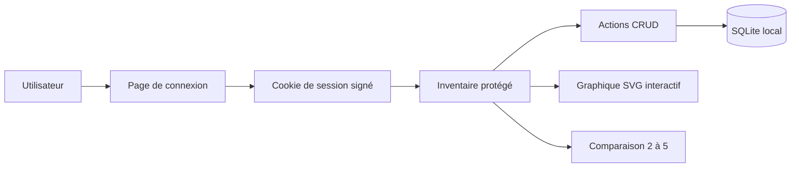
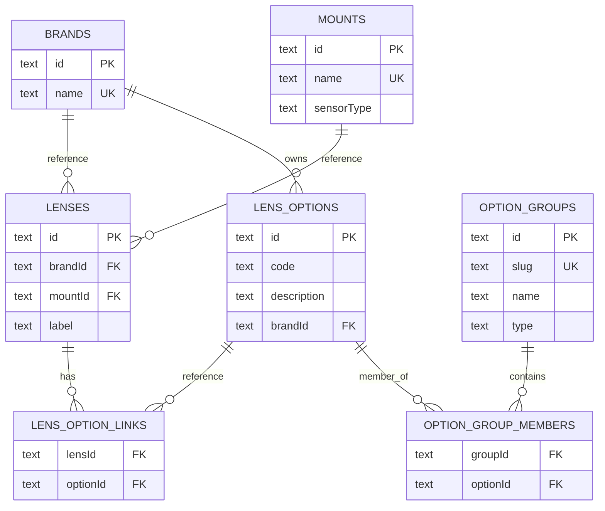

# PhotoPark

Application privée Next.js pour inventorier, filtrer, visualiser et comparer des objectifs photo.

## Fonctionnalités

- Accès protégé par mot de passe unique.
- Mot de passe stocké sous forme de hash PBKDF2 SHA-256.
- Session signée avec `SESSION_SECRET` et cookie `HttpOnly`, `SameSite=Lax`, `Secure` en production.
- Rate limiting du formulaire de connexion.
- Protection d’origine sur les actions mutatives.
- Stockage SQLite local avec `better-sqlite3`.
- CRUD complet des objectifs, avec statut `Retiré`.
- Import client depuis un libellé d’objectif pour préremplir le formulaire.
- Référentiels administrables pour les marques, les montures et les options, ces dernières étant liées à une marque spécifique.
- Relation 1-N entre une marque et les objectifs, et entre une monture et les objectifs.
- Options associées aux objectifs en N-N avec un code court et une description.
- Tableau desktop et cartes mobile avec type `Fixe`/`Zoom`, plages identiques compactées (`7.8 mm`, `f/4`), badges de statut dont `Retiré`, prix formatés avec espaces pour les milliers et toujours 2 décimales (`3 314.00 €`), et poids formatés avec espaces pour les milliers (`1 079 g`).
- Filtres par texte, marque, monture, option, type (`Tous`, `Fixe`, `Zoom`), statut et quatre plages numériques réglables par curseurs à double poignée (focale min 0–300 mm, focale max 0–300+ mm, ouverture à focale min f/1–f/30, ouverture à focale max f/1–f/30). Les deux plages de focale démarrent sur `0–300+ mm`. La borne haute `300` est ouverte et signifie `300 mm et plus`.
- Graphique SVG interactif focale/ouverture disposé en mise en page deux colonnes (4/5 graphique, 1/5 liste à cocher) avec zoom molette, pan tactile, sélection et masquage d’objectifs. À l’ouverture, il coche automatiquement les objectifs possédés et non retirés.
- Comparaison de 2 à 5 objectifs avec différences en gras.
- Navigation multi-pages avec barre de navigation : Objectifs, Boîtiers, Accessoires, Paramètres.
- Pages paramètres séparées pour les marques, les montures, les options et les groupes d’options.
- Pages « Boîtiers » et « Accessoires » préparées pour un futur inventaire.
- Tests Vitest pour la validation et les helpers métier.

Le schéma suivant résume le flux principal de l’application.


*Figure: Flux entre authentification, inventaire, stockage SQLite et vues de visualisation.*

## Prérequis

- Node.js compatible avec Next.js 15.
- npm.
- Un serveur ou poste capable d’écrire dans le dossier configuré par `DATABASE_PATH`.

## Installation rapide

```bash
npm install
cp .env.example .env
npm run hash-password -- "mot-de-passe-fort"
```

Copiez le hash affiché dans `APP_PASSWORD_HASH`, puis renseignez `SESSION_SECRET`.

Vous pouvez générer un secret avec Node.js :

```bash
node -e "console.log(require('node:crypto').randomBytes(32).toString('base64url'))"
```

## Configuration

Créez un fichier `.env` à partir de `.env.example`.

| Variable | Obligatoire | Exemple | Description |
|---|---:|---|---|
| `APP_PASSWORD_HASH` | Oui | `pbkdf2:sha256:310000:...` | Hash PBKDF2 généré par `npm run hash-password -- "mot-de-passe-fort"`. Ne stockez pas le mot de passe en clair. |
| `SESSION_SECRET` | Oui | `long-secret-aleatoire` | Secret de signature des sessions. Utilisez au moins 32 caractères aléatoires. Une rotation invalide les sessions existantes. |
| `DATABASE_PATH` | Non | `./data/photos.sqlite` | Chemin du fichier SQLite. Le dossier parent est créé automatiquement. |
| `NEXT_PUBLIC_APSC_CROP_FACTOR` | Non | `1.5` | Facteur de conversion APS-C. Cette variable est publique côté client. Reconstruisez l’application après modification en production. |
| `TRUST_PROXY` | Non | `false` | Mettez `true` uniquement si un reverse proxy de confiance écrase strictement `X-Forwarded-For`. |

> ⚠️ Assumed: l’application reste mono-utilisateur et privée. Elle n’inclut pas de création de comptes, de rôles ou de récupération de mot de passe.

## Développement

```bash
npm run dev
```

Ouvrez ensuite l’URL affichée par Next.js, généralement `http://localhost:3000`.

## Saisie des objectifs

### Statut Retiré

Le formulaire d’objectif inclut une case à cocher `Retiré`.

Activez-la pour marquer un objectif retiré de votre parc sans le supprimer de l’historique.

Quand un objectif est retiré :

- l’interface affiche le badge `Retiré` ;
- ce statut peut apparaître avec les autres badges ;
- la page du graphique ne le coche pas automatiquement au chargement, même s’il est marqué comme possédé.

### Import depuis un libellé

Dans le formulaire d’objectif, collez un libellé dans le champ `Libellé` pour préremplir les champs structurés lorsque les éléments existent déjà dans les référentiels.

Exemple :

```text
Canon EF 18-55 F/3,5-5,6 IS
```

L’application peut reconnaître la marque, la monture, les focales, les ouvertures maximales et les options présentes dans les référentiels chargés. Modifiez ensuite les champs si nécessaire.

Le libellé affiché en aperçu se régénère automatiquement à partir des champs structurés. Le texte collé n’est pas enregistré tel quel : le serveur reconstruit toujours le libellé final depuis la marque, la monture, les focales, les ouvertures et les options sélectionnées.

### Valeurs numériques

Le formulaire accepte les nombres avec un point ou une virgule comme séparateur décimal.

Vous pouvez saisir indifféremment :

```text
2.8
2,8
```

Le champ `Ouverture max à max focale` est optionnel. Si vous le laissez vide, l’application reprend automatiquement la valeur du champ `Ouverture max à min focale`.

Dans l’inventaire et la comparaison :

- un prix s’affiche toujours avec 2 décimales et des espaces pour les milliers, par exemple `3 314.00 €` ;
- un poids s’affiche avec des espaces pour les milliers, par exemple `1 079 g` ;
- la valeur `0` reste affichée et n’est pas traitée comme une valeur vide.

Ce comportement simplifie la saisie :

- des focales fixes ;
- des zooms à ouverture constante.

Exemple pour un objectif `50 mm f/1.8` : renseignez `Ouverture max à min focale` avec `1.8` ou `1,8`, puis laissez `Ouverture max à max focale` vide.

### Détection des doublons

Lors de la création ou de la modification d’un objectif, l’application vérifie qu’aucun autre objectif n’utilise déjà la même combinaison des six champs suivants :

- Marque
- Monture
- Focale min
- Focale max
- Ouverture max à min focale
- Ouverture max à max focale

Si un doublon est détecté, le formulaire reste ouvert et un message d’erreur s’affiche en haut de la fenêtre avec le libellé de l’objectif existant. Vous pouvez modifier les champs en conflit ou annuler.

Lors d’une modification, le système exclut l’objectif en cours de modification de la recherche. Vous pouvez donc enregistrer des changements sur des champs hors de ces six critères.

Si votre base contient déjà un doublon historique identique, vous pouvez aussi modifier l’objectif actuel tant que vous ne changez pas ces six champs d’identité.

En revanche, si la modification change ces champs d’identité et entre en collision avec un autre objectif existant, l’enregistrement reste refusé.

## Scripts

| Commande | Rôle |
|---|---|
| `npm run dev` | Lance le serveur de développement Next.js. |
| `npm run build` | Compile l’application pour la production. |
| `npm run start` | Lance l’application compilée. |
| `npm run lint` | Lance le script de lint configuré dans `package.json`. |
| `npm run typecheck` | Vérifie les types TypeScript sans générer de sortie. |
| `npm run test` | Exécute les tests Vitest une fois. |
| `npm run hash-password -- "mot-de-passe"` | Génère le hash PBKDF2 à placer dans `APP_PASSWORD_HASH`. |

## Tests

Les tests utilisent Vitest avec l’environnement Node. La suite contient actuellement 230 tests.

```bash
npm run test
```

La suite couvre actuellement :

- la validation des objectifs avec Zod ;
- la validation des référentiels de marques, montures, options et groupes d’options ;
- la coercition des valeurs numériques et booléennes issues des formulaires ;
- les règles métier sur les focales et ouvertures ;
- la génération de libellés ;
- le parsing des libellés collés dans le formulaire (filtrage des options par marque identifiée) ;
- le calcul des équivalents APS-C ;
- les helpers de formatage ;
- les groupes d’options (CRUD, assignation, affichage dans le comparateur) ;
- le filtrage des options par marque dans les formulaires et le gestionnaire de paramètres ;
- le composant `DualRangeSlider` (rendu, positionnement de la barre de sélection, contrainte basse/haute, valeurs formatées, cas limites) ;
- la fonction `filterLenses` (tous les types de filtres — textuel, marque, monture, option, type `Fixe`/`Zoom`, statut, plages numériques — filtres combinés, valeurs limites inclusives).

Avant un déploiement, exécutez au minimum :

```bash
npm run typecheck
npm run test
npm run build
```

## Déploiement serveur personnel

1. Installez les dépendances.
2. Créez le fichier `.env` avec des secrets de production.
3. Vérifiez que le chemin `DATABASE_PATH` pointe hors des dossiers publics.
4. Lancez la compilation.
5. Démarrez l’application derrière un reverse proxy HTTPS.

```bash
npm install
npm run build
npm run start
```

Placez l’application derrière Caddy, Nginx, Traefik ou un reverse proxy équivalent avec HTTPS activé.

Recommandations de sécurité :

- Lancez le processus avec un utilisateur système non privilégié.
- Ne versionnez jamais `.env`, `data/`, les bases SQLite ni les sauvegardes.
- Gardez `NODE_ENV=production` en production pour activer le cookie `Secure`.
- Gardez `TRUST_PROXY=false` si le proxy ne réécrit pas strictement `X-Forwarded-For`.
- Si `TRUST_PROXY=false`, le rate limiting du login est global au processus.
- Si `TRUST_PROXY=true`, le rate limiting utilise la première IP de `X-Forwarded-For`.
- Configurez le reverse proxy pour remplacer les en-têtes `X-Forwarded-*`, pas seulement les transmettre.
- Restreignez l’accès réseau si l’application n’est pas destinée à Internet.

L’application ajoute aussi les en-têtes suivants via `next.config.ts` :

- `X-Content-Type-Options: nosniff`
- `Referrer-Policy: strict-origin-when-cross-origin`
- `X-Frame-Options: DENY`

## Base de données

La base SQLite est créée automatiquement au premier accès si elle n’existe pas.

Par défaut, elle se trouve ici :

```text
./data/photos.sqlite
```

Le dépôt ignore déjà les fichiers SQLite, le dossier `data/`, `.env` et les artefacts de build.

### Référentiels

Les marques, les montures et les options ne sont plus des champs libres saisis directement dans chaque objectif. L’application les stocke dans des listes administrables accessibles depuis la barre de navigation via Paramètres > Marques, Paramètres > Montures et Paramètres > Options.

| Référentiel | Champs | Utilisation |
|---|---|---|
| Marques | `name` | Une marque peut être liée à plusieurs objectifs. Chaque objectif référence une seule marque. |
| Montures | `name`, `sensorType` | Une monture peut être liée à plusieurs objectifs. Chaque objectif référence une seule monture. Le type de capteur est porté par la monture. |
| Options | `code`, `description`, `brandId` | Une option est liée à une seule marque. Elle peut être associée à plusieurs objectifs de cette marque. Un objectif peut avoir plusieurs options. |

Les données par défaut ajoutent la marque `Canon`, les montures `Canon RF`, `Canon RF-S`, `Canon EF` et `Canon EF-S`, ainsi que les options `L`, `IS`, `USM` et `STM` liées à Canon. Trois groupes d’options sont également créés : Stabilisation (type *flag*), Motorisation (type *value*) et Série (type *value*), avec les options Canon assignées aux groupes correspondants.

Le schéma suivant montre les relations principales entre les objectifs et les référentiels.


*Figure: Relations entre objectifs, marques, montures, options et groupes d’options.*

### Contraintes de suppression

SQLite protège les référentiels utilisés par des objectifs.

- Vous ne pouvez pas supprimer une marque si au moins un objectif l’utilise.
- Vous ne pouvez pas supprimer une monture si au moins un objectif l’utilise.
- Vous ne pouvez pas supprimer une option si au moins un objectif l’utilise.
- Vous ne pouvez pas supprimer un groupe d’options si au moins une option y est assignée. Retirez d’abord les options du groupe depuis la page de gestion.
- Vous pouvez supprimer un objectif sans supprimer ses référentiels. Les liens vers ses options sont supprimés automatiquement.

Pour supprimer une entrée de référentiel, modifiez ou supprimez d’abord les objectifs qui la référencent.

### Migration des anciennes bases

Une migration legacy convertit automatiquement les anciennes colonnes libres `brand`, `mount`, `sensorType` et `options` vers les nouveaux référentiels au premier accès à la base.

- Les anciennes marques et montures deviennent des entrées de référentiel.
- Le type de capteur existant est déplacé sur la monture.
- Les anciennes options séparées par espaces deviennent des options avec un `code` et une `description` identiques.
- Les objectifs migrés référencent ensuite les nouveaux identifiants de marque, monture et options.

Une migration ultérieure ajoute la colonne `brandId` à la table `lens_options` et impose la contrainte `UNIQUE(code, brandId)`. Les options orphelines (sans marque) sont automatiquement liées à la marque « Autre » créée lors de la migration. La table `lens_option_links` est également recréée si sa clé étrangère pointe encore vers une table legacy `lenses_legacy_*`.

Au démarrage, l’application répare aussi automatiquement les bases SQLite existantes si la table `lenses` ne contient pas encore les colonnes `minApertureAtMinFocal`, `minApertureAtMaxFocal` ou `retired`.

Avant de lancer une version contenant cette migration sur une base existante, créez une sauvegarde du fichier SQLite.

## Dépannage

### Erreur `FOREIGN KEY` lors de la modification des options

Une ancienne migration pouvait laisser la table `lens_option_links` avec une clé étrangère vers une table temporaire `lenses_legacy_*` sur une base déjà migrée.

Si une modification d’options échoue avec une erreur SQLite `FOREIGN KEY`, redémarrez le serveur de développement puis relancez l’import ou l’accès à la base. Au prochain chargement, la réparation interne recrée `lens_option_links` avec les bonnes références.

```bash
npm run dev
```

Si l’erreur persiste après redémarrage, sauvegardez le fichier SQLite puis vérifiez que l’application utilise bien la version contenant cette réparation.

## Sauvegardes

Sauvegardez régulièrement le fichier indiqué par `DATABASE_PATH`.

Incluez aussi les fichiers WAL éventuels si la base est active :

```text
photos.sqlite
photos.sqlite-wal
photos.sqlite-shm
```

Testez périodiquement une restauration sur une copie de l’application.
